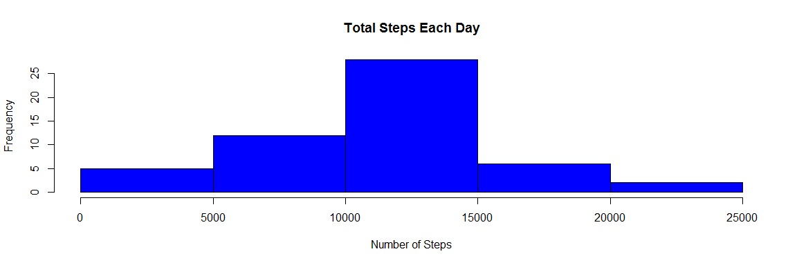
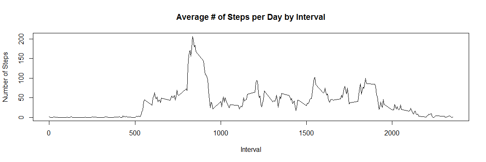
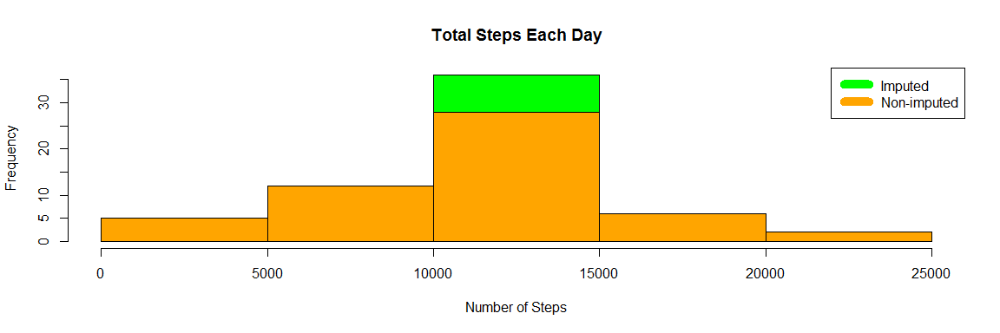
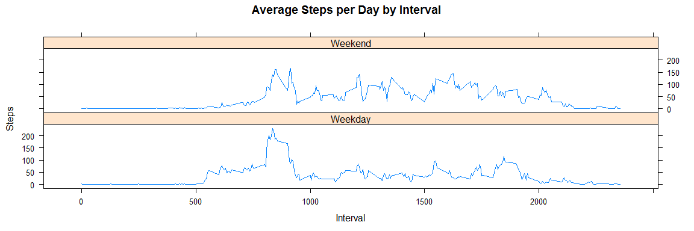

# Reproducible Research: Peer Assessment 1
Michael Rith  
July 12, 2016  

```r
setwd("C:/Users/mrith/Documents/ReproducableResearch")
#Open Data Set
data <- read.csv("activity.csv")
#install lattice package
library(lattice)
library(knitr)
```

```
## Warning: package 'knitr' was built under R version 3.2.5
```

```r
library(markdown)
```

```
## Warning: package 'markdown' was built under R version 3.2.5
```

Create Histogram with Mean and Median values for number of steps

```r
#Sum steps by day, create Histogram, and calculate mean and median.
steps_by_day <- aggregate(steps ~ date, data, sum)
hist(steps_by_day$steps, main = paste("Total Steps Each Day"), col="blue", xlab="Number of Steps")
```

<!-- -->

```r
rmean <- mean(steps_by_day$steps)
rmedian <- median(steps_by_day$steps)
```

The Mean is 10766.19 and the Median is 10765

#What is the average daily activity?


```r
steps_by_interval <- aggregate(steps ~ interval, data, mean)

plot(steps_by_interval$interval,steps_by_interval$steps, 
     type="l", xlab="Interval",
     ylab="Number of Steps",
     main="Average # of Steps per Day by Interval")
```

<!-- -->
Remove all missing variables and imputed zeros

```r
removeNA <- sum(!complete.cases(data))
imputed_data <- transform(data, steps = ifelse(is.na(data$steps), steps_by_interval$steps[match(data$interval, steps_by_interval$interval)], data$steps))
```
Total Step recount and create a Histogram

```r
steps_by_day_i <- aggregate(steps ~ date, imputed_data, sum)
hist(steps_by_day_i$steps, main = paste("Total Steps Each Day"), col="green", xlab="Number of Steps")

#Create Histogram graph to show difference. 
hist(steps_by_day$steps, main = paste("Total Steps Each Day"), col="orange", xlab="Number of Steps", add=T)
legend("topright", c("Imputed", "Non-imputed"), col=c("green", "orange"), lwd=10)
```

<!-- -->
Calculate new mean and median for imputed data.


```r
rmean.i <- mean(steps_by_day_i$steps)
rmedian.i <- median(steps_by_day_i$steps)
```

Calculate difference between imputed and non-imputed data.

```r
mean_diff <- rmean.i - rmean
med_diff <- rmedian.i - rmedian
```
Calculate total difference.


```r
total_diff <- sum(steps_by_day_i$steps) - sum(steps_by_day$steps)
```
* The imputed data mean is 10766.19
* The imputed data median is 10766.19
* The difference between the non-imputed mean and imputed mean is 0
* The difference between the non-imputed median and imputed median is 1.188679
* The difference of 86129.51 was the number of more steps in the imputed data.

#Are there differences in activity patterns between weekdays and weekends?
Want to create a plot to compare and contrast number of steps between the week and weekend. There is a higher peak earlier on weekdays, and more overall activity on weekends.

```r
weekdays <- c("Monday", "Tuesday", "Wednesday", "Thursday", 
              "Friday")
imputed_data$dow = as.factor(ifelse(is.element(weekdays(as.Date(imputed_data$date)),weekdays), "Weekday", "Weekend"))

steps_by_interval_i <- aggregate(steps ~ interval + dow, imputed_data, mean)


xyplot(steps_by_interval_i$steps ~ steps_by_interval_i$interval|steps_by_interval_i$dow, 
       main="Average Steps per Day by Interval",xlab="Interval", 
       ylab="Steps",layout=c(1,2), type="l")
```

<!-- -->


Note that the `echo = FALSE` parameter was added to the code chunk to prevent printing of the R code that generated the plot.
